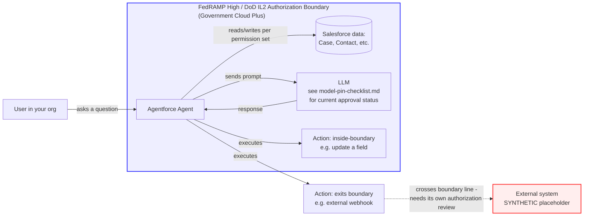

# One-Page Data Flow Diagram Template

Use this to draw a single-page picture of one agent's data flow before it goes to ISSO review. The point is to make the authorization boundary visible on one page, not to document every technical detail.

SYNTHETIC example below. Redraw with your own agent's actual flow.

## How to fill this in for your agent

1. **User**: who or what triggers the agent (a person in a Salesforce UI, an API call, a scheduled flow).
2. **Agent**: your agent's name and the topic(s) it handles.
3. **Data**: every object/field the agent reads or writes — should match `docs/field-access-worksheet.md` exactly.
4. **Model**: which LLM backs this agent's reasoning. Re-check `docs/model-pin-checklist.md` — do not assume the model shown in Setup is authorized just because it's selectable.
5. **Actions**: pull directly from `docs/action-inventory-template.csv`. Draw a box per action, and put the boundary line so it visibly separates "inside boundary" actions from "exits boundary" actions.
6. **Boundary box**: draw one clear line. Everything inside is in the FedRAMP High / DoD IL2 (or FedRAMP High DoD IL5 for Government Cloud Plus - Defense — confirm your specific environment) authorization boundary. Everything the line crosses needs its own documented authorization or interconnection agreement.

If you don't use Mermaid or a diagramming tool, a hand-drawn version with the same five boxes and one boundary line works. The requirement is that the boundary line exists and is visible, not that the diagram is polished.
